I’m an engineer in NYC, currently pursuing an **M.S. in Emerging Technology (AI/ML) at NYU Tandon**.

I’m interested in **backend engineering, AI/ML systems, automation, and infrastructure**. I like working with APIs, data pipelines, model serving, search, queues, and databases—and making those pieces work together.

## Tech

| Area | Tools and technologies |
| --- | --- |
| **Languages** | Python · JavaScript · TypeScript · SQL · Java |
| **Backend / infrastructure** | FastAPI · PostgreSQL · Redis · Docker · REST APIs · AWS |
| **AI / ML** | PyTorch · Computer vision · RAG · LLM systems · Vector search |
| **Frontend** | React |

## My life

- Knicks basketball
- Strength training
- Video games
- Reading and learning about systems, AI, and whatever else catches my curiosity
